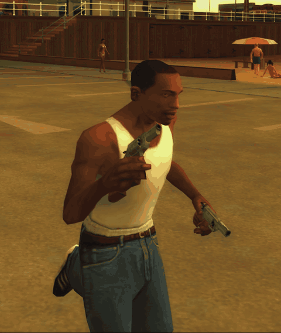
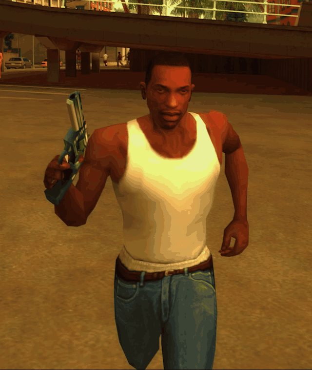

# SA.StoriesSprinting

A native GTA: San Andreas ASI that replaces H-G's "Stories Sprinting" CLEO
script. It lets you sprint with heavy weapons and use the one-handed jog run
animation, with a **configurable weapon list** (edit `SA.StoriesSprinting.ini`)
that supports **fastman92 add-on weapons** — matched by weapon type *or* model
ID. The "eASIer" memory patches are folded in, so no separate patcher plugin is
needed, and **AI Walkstyles Fix** is built in as an optional setting.

  
  

Built with [plugin-sdk](https://github.com/DK22Pac/plugin-sdk). Targets
**GTA SA 1.0 US (HOODLUM)**.

## Install

Drop `SA.StoriesSprinting.asi` and `SA.StoriesSprinting.ini` into your game
(with an ASI loader). Keep the rest of the animation mod — the `.ifp`
animations and the weapon.dat anim-group edits — in place.

## AI Weapon Walkstyles

The mod also absorbs **AI Walkstyles Fix** — peds get the same weapon walkstyles
the player does, so they carry a rifle or a rocket launcher properly instead of
holding it one-handed. Set `AIWeaponWalkstyles=1` to turn it on (off by default);
the weapon lists live under `[AIWalkstyles]`, with a `RifleSlots` fallback so
add-on long guns are covered without listing them.

`AIGroupSprintFix=1` (on by default) fixes a hardcoded game behaviour: peds in
the player's group sprint with the plain civilian sprint no matter what they are
carrying, so a homie with a rifle sprints one-handed. It patches
`CPed::SetMoveAnim` to sprint from the ped's own walkstyle group instead.

`AIStoriesSprintingCombo=1` additionally lets peds use the one-handed jog from
`[JogWeapons]` (and the fire-extinguisher walkstyle from `[FireExtWeapons]`).
Off by default. The fire-extinguisher fix itself is the mod's existing
`FireExtinguisherWalkstyleFix` setting — there is no second copy of it.

## Config

`[JogWeapons]`, `[FireExtWeapons]` and the `[AIWalkstyles]` lists in
`SA.StoriesSprinting.ini` take comma/space-separated weapon IDs (weapon type for
vanilla, model ID for add-on weapons). Reloads live while you play.

## Build

Needs the plugin-sdk with the `PLUGIN_SDK_DIR` environment variable set.
Build `SA.StoriesSprinting.vcxproj` (configuration **Release GTA-SA**, platform
**Win32**, toolset **v145**).
